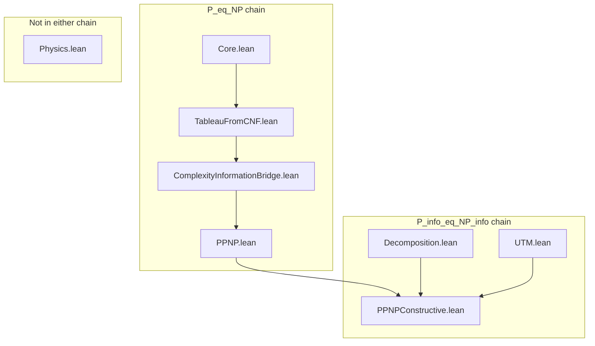

# Audit of EGPT Complexity Folder

## Executive Summary

This audit identifies components within `Lean/EGPT/Complexity/` relative to the **two formal P=NP proof chains**:

1. **P_eq_NP chain** ([`PPNP.lean`](PPNP.lean)) — Definitional identity `P = NP` via `Set.ext` + `Iff.rfl`
2. **P_info_eq_NP_info chain** ([`PPNPConstructive.lean`](PPNPConstructive.lean)) — Information-theoretic formulation

Both chains are sorry-free and axiom-free. This document recommends removals, renames, semantic invocations, and file consolidation.

---

## 1. Proof Chain Dependency Graph

**Key correction vs. prior audit:** UTM and Decomposition are **used by PPNPConstructive**. Physics.lean (Complexity) is **not** used by either chain.

---

## 2. Removal Recommendations (a)

| File | In P_eq_NP? | In P_info_eq_NP_info? | Recommendation |
|------|-------------|------------------------|----------------|
| `Physics.lean` | No | No | **Remove or relocate** to `Lean/EGPT/Physics/` or `Lean/EGPT/Simulation/`. Contains RejectionFilter, NDTM_A_run, deterministic breadth — motivation only, not proof. |
| `Interpretation.lean` | Re-export only | Re-export only | **Merge** — it is a 2-line import shim of ComplexityInformationBridge. The theorems live in ComplexityInformationBridge under namespace `Interpretation`. Either fold into Bridge or keep as thin re-export for human navigation. |

---

## 3. Rename Recommendations (b)

| Current Name | Suggested Name | Role |
|--------------|----------------|------|
| `allSatisfyingAssignments_nonempty_iff_bounded_tableau` | `semantic_nonempty_iff_bounded_tableau` or `sat_iff_bounded_certificate` | Semantic-to-constructive bridge; clearer for reviewers |
| `walkComplexity_upper_bound` | `walk_cost_bounded_by_n_squared` | Explicitly states the n² bound |
| `nSquared_time_complexity_is_information_complexity` | `time_equals_information_at_n_squared` | Shorter, clearer |
| `walk_nSquared_bound_is_time_and_information` | `walk_cost_is_time_and_information` | Aligns with above |
| `PathToConstraint` | Keep or `literal_address_cost` | Already documented; optional |
| `equivPathNat`, `equivCNFPath`, `pathNat`, `natPath` | Keep | Already reviewer-facing aliases |

---

## 4. Semantic Clarity Invocations (c)

Add explicit theorem invocations in proof scripts for human readers, even when the term is inferable:

| Location | Invoke | Purpose |
|----------|--------|---------|
| `PPNP.allSatisfyingAssignments_nonempty_iff_bounded_tableau` | `equivParticlePathToNat` (or a bridge lemma) | Remind reader that CNF ≃ ℕ |
| `PPNP.L_SAT_in_NP` / `L_SAT_in_P` | `walkCNFPaths` by name in comment or `have` | Make construction explicit |
| `PPNPConstructive.complete_information_extraction` | `timeComplexity_eq_length` | Emphasize "reading = processing" |
| `PPNPConstructive.P_info_eq_NP_info` | `walk_construction_iff_bounded_certificate` | Make P↔NP bridge explicit |

These can be `have _ :=` or docstring references; goal is narrative clarity.

---

## 5. Complexity Declarations — Suggested File, Role, Delete?

Full inventory from `node scripts/list_complexity_declarations.js`. See [COMPLEXITY_INVENTORY.md](COMPLEXITY_INVENTORY.md) for the raw listing.

| Declaration | Current File | Suggested File | Role in Core Chains | Delete? |
|-------------|--------------|----------------|---------------------|---------|
| `IsPolynomialEGPT` | Core.lean | Core.lean | Used in P_eq_NP (polynomial defs) | No |
| `IsBoundedByEGPT_Polynomial` | Core.lean | Core.lean | Used in P_eq_NP | No |
| `PathToConstraint` | Core.lean | Core.lean | Used in both chains | No |
| `CanonicalCNFProgram` | Core.lean | Core.lean | Used in P_eq_NP | No |
| `equivPathNat` | Core.lean | Core.lean | Used in both | No |
| `equivCNFPath` | Core.lean | Core.lean | Used in both | No |
| `pathNat`, `natPath` | Core.lean | Core.lean | Used in both | No |
| `encodeCanonicalCNFAsProgram` | Core.lean | Core.lean | Used in P_eq_NP | No |
| `encodeCanonicalCNFAsProgram_eq_encodeCNF` | Core.lean | Core.lean | Used in P_eq_NP | No |
| `encodeCanonicalCNFAsProgram_length` | Core.lean | Core.lean | Used in P_eq_NP | No |
| `combinePrograms` | Core.lean | Core.lean | Used in P_eq_NP | No |
| `combinePrograms_eq_append` | Core.lean | Core.lean | Used in P_eq_NP | No |
| `combinePrograms_length` | Core.lean | Core.lean | Used in P_eq_NP | No |
| `computerProgram_sum_is_program` | Core.lean | Core.lean | Used in P_eq_NP | No |
| `SatisfyingTableau` | TableauFromCNF.lean | TableauFromCNF.lean | Used in both chains | No |
| `SatisfyingTableau.complexity` | TableauFromCNF.lean | TableauFromCNF.lean | Used in both | No |
| `walkCNFPaths` | TableauFromCNF.lean | TableauFromCNF.lean | Used in both | No |
| `SatisfyingTableau.toComputerProgram` | TableauFromCNF.lean | TableauFromCNF.lean | Used in P_info | No |
| `SatisfyingTableau.toComputerProgram_eq_bind` | TableauFromCNF.lean | TableauFromCNF.lean | Used in P_info | No |
| `walkComplexity_eq_sum_of_paths` | TableauFromCNF.lean | TableauFromCNF.lean | Used in both | No |
| `cost_of_walk_le_k` | TableauFromCNF.lean | TableauFromCNF.lean | Used in both | No |
| `path_complexity_le_k` | TableauFromCNF.lean | TableauFromCNF.lean | Used in both | No |
| `walkComplexity_upper_bound` | TableauFromCNF.lean | TableauFromCNF.lean | Used in both | No |
| `computeTableau` | TableauFromCNF.lean | TableauFromCNF.lean | Used in P_info | No |
| `constructSatisfyingTableau` | TableauFromCNF.lean | TableauFromCNF.lean | Alias for walkCNFPaths | No |
| `tableauComplexity_upper_bound` | TableauFromCNF.lean | TableauFromCNF.lean | Alias for walkComplexity_upper_bound | No |
| `nSquared_time_complexity_is_information_complexity` | ComplexityInformationBridge.lean | ComplexityInformationBridge.lean | Used in P_eq_NP | No |
| `walk_nSquared_bound_is_time_and_information` | ComplexityInformationBridge.lean | ComplexityInformationBridge.lean | Used in P_eq_NP | No |
| `AllSatisfyingAssignments` | PPNP.lean | PPNP.lean | Used in both | No |
| `mem_AllSatisfyingAssignments` | PPNP.lean | PPNP.lean | Used in both | No |
| `allSatisfyingAssignments_nonempty_iff_exists` | PPNP.lean | PPNP.lean | Used in both | No |
| `L_SAT_Canonical` | PPNP.lean | PPNP.lean | Used in both | No |
| `canonicalInputProgram` | PPNP.lean | PPNP.lean | Used in P_eq_NP | No |
| `canonicalInputProgram_length` | PPNP.lean | PPNP.lean | Used in P_eq_NP | No |
| `canonical_poly` | PPNP.lean | PPNP.lean | Used in both | No |
| `canonical_np_poly` | PPNP.lean | PPNP.lean | Used in both | No |
| `eval_canonical_np_poly` | PPNP.lean | PPNP.lean | Used in both | No |
| `NP` | PPNP.lean | PPNP.lean | Used in both | No |
| `allSatisfyingAssignments_nonempty_iff_bounded_tableau` | PPNP.lean | PPNP.lean | Used in both | No |
| `L_SAT_in_NP` | PPNP.lean | PPNP.lean | Used in both | No |
| `L_SAT_in_NP_Hard` | PPNP.lean | PPNP.lean | Used in P_eq_NP | No |
| `IsNPComplete` | PPNP.lean | PPNP.lean | Used in P_eq_NP | No |
| `EGPT_CookLevin_Theorem` | PPNP.lean | PPNP.lean | Used in P_eq_NP | No |
| `canonical_n_squared_bound` | PPNP.lean | PPNP.lean | Used in both | No |
| `P` | PPNP.lean | PPNP.lean | Used in both | No |
| `L_SAT_in_P` | PPNP.lean | PPNP.lean | Used in both | No |
| `P_eq_NP` | PPNP.lean | PPNP.lean | Capstone of P_eq_NP chain | No |
| `ConstructiveDecomposition` | Decomposition.lean | Decomposition.lean | Used in P_info | No |
| `ConstructiveDecomposition.complexity` | Decomposition.lean | Decomposition.lean | Used in P_info | No |
| `decomposeCNF` | Decomposition.lean | Decomposition.lean | Used in P_info | No |
| `negateLiteral` | Decomposition.lean | Decomposition.lean | Used in P_info | No |
| `WalkWitness` | Decomposition.lean | Decomposition.lean | Used in P_info | No |
| `ClauseCoveredBy` | Decomposition.lean | Decomposition.lean | Used in P_info | No |
| `CoversAllClauses` | Decomposition.lean | Decomposition.lean | Used in P_info | No |
| `PolarityConsistent` | Decomposition.lean | Decomposition.lean | Used in P_info | No |
| `AssignmentFreeSAT` | Decomposition.lean | Decomposition.lean | Used in P_info | No |
| `assignmentFromWitness` | Decomposition.lean | Decomposition.lean | Used in P_info | No |
| `witness_true_implies_eval_true` | Decomposition.lean | Decomposition.lean | Used in P_info | No |
| `assignmentFree_sound` | Decomposition.lean | Decomposition.lean | Used in P_info | No |
| `witnessFromAssignment` | Decomposition.lean | Decomposition.lean | Used in P_info | No |
| `witnessFromAssignment_covers` | Decomposition.lean | Decomposition.lean | Used in P_info | No |
| `witnessFromAssignment_consistent` | Decomposition.lean | Decomposition.lean | Used in P_info | No |
| `assignmentFree_complete` | Decomposition.lean | Decomposition.lean | Used in P_info | No |
| `assignmentFree_iff_sat` | Decomposition.lean | Decomposition.lean | Used in P_info | No |
| `assignmentFree_iff_nonempty_allSatisfyingAssignments` | Decomposition.lean | Decomposition.lean | Used in P_info | No |
| `decomposition_poly` | Decomposition.lean | Decomposition.lean | Used in P_info | No |
| `eval_decomposition_poly` | Decomposition.lean | Decomposition.lean | Used in P_info | No |
| `decomposition_is_poly_bounded` | Decomposition.lean | Decomposition.lean | Used in P_info | No |
| `chosenLiteral` | Decomposition.lean | Decomposition.lean | Used in P_info | No |
| `assignmentCompositePrime` | Decomposition.lean | Decomposition.lean | Used in P_info | No |
| `literalSharesFactor` | Decomposition.lean | Decomposition.lean | Used in P_info | No |
| `clauseSharesFactor` | Decomposition.lean | Decomposition.lean | Used in P_info | No |
| `cnfSharesFactor` | Decomposition.lean | Decomposition.lean | Used in P_info | No |
| `CNFSharesFactor` | Decomposition.lean | Decomposition.lean | Used in P_info | No |
| `evalLiteral_chosenLiteral_true` | Decomposition.lean | Decomposition.lean | Used in P_info | No |
| `evalLiteral_eq_true_iff_polarity_eq` | Decomposition.lean | Decomposition.lean | Used in P_info | No |
| `evalLiteral_true_iff_literalSharesFactor` | Decomposition.lean | Decomposition.lean | Used in P_info | No |
| `evalClause_true_iff_clauseSharesFactor` | Decomposition.lean | Decomposition.lean | Used in P_info | No |
| `evalCNF_true_iff_cnfSharesFactor` | Decomposition.lean | Decomposition.lean | Used in P_info | No |
| `cnfSharesFactor_iff_nonempty_allSatisfyingAssignments` | Decomposition.lean | Decomposition.lean | Used in P_info | No |
| `exists_assignment_of_cnfSharesFactor` | Decomposition.lean | Decomposition.lean | Used in P_info | No |
| `cnfSharesFactor_of_exists_assignment` | Decomposition.lean | Decomposition.lean | Used in P_info | No |
| `ReadHead` | UTM.lean | UTM.lean | Used in P_info | No |
| `ReadHead.init` | UTM.lean | UTM.lean | Used in P_info | No |
| `ReadHead.step` | UTM.lean | UTM.lean | Used in P_info | No |
| `ReadHead.run` | UTM.lean | UTM.lean | Used in P_info | No |
| `timeComplexity` | UTM.lean | UTM.lean | Used in P_info | No |
| `ReadHead.run_exhausts` | UTM.lean | UTM.lean | Used in P_info | No |
| `ReadHead.run_steps` | UTM.lean | UTM.lean | Used in P_info | No |
| `timeComplexity_eq_length` | UTM.lean | UTM.lean | Used in P_info | No |
| `timeComplexity_eq_toNat` | UTM.lean | UTM.lean | Used in P_info | No |
| `timeComplexity_append` | UTM.lean | UTM.lean | Used in P_info | No |
| `timeComplexity_nil` | UTM.lean | UTM.lean | Used in P_info | No |
| `timeComplexity_singleton` | UTM.lean | UTM.lean | Used in P_info | No |
| `time_eq_information_eq_complexity` | UTM.lean | UTM.lean | Used in P_info | No |
| `time_complexity_of_rect_program` | UTM.lean | UTM.lean | Used in P_info | No |
| `cnfInformationContent` | PPNPConstructive.lean | PPNPConstructive.lean | Used in P_info | No |
| `cnfAsProgram` | PPNPConstructive.lean | PPNPConstructive.lean | Used in P_info | No |
| `walkConstructionProgram` | PPNPConstructive.lean | PPNPConstructive.lean | Used in P_info | No |
| `toComputerProgram_length_eq_complexity` | PPNPConstructive.lean | PPNPConstructive.lean | Used in P_info | No |
| `information_content_le_nSquared` | PPNPConstructive.lean | PPNPConstructive.lean | Used in P_info | No |
| `walk_bounded_by_information_content` | PPNPConstructive.lean | PPNPConstructive.lean | Used in P_info | No |
| `walk_complexity_le_nSquared` | PPNPConstructive.lean | PPNPConstructive.lean | Used in P_info | No |
| `walk_timeComplexity_le_nSquared` | PPNPConstructive.lean | PPNPConstructive.lean | Used in P_info | No |
| `walk_time_eq_information` | PPNPConstructive.lean | PPNPConstructive.lean | Used in P_info | No |
| `walk_visits_every_clause` | PPNPConstructive.lean | PPNPConstructive.lean | Used in P_info | No |
| `evalCNF_is_computable` | PPNPConstructive.lean | PPNPConstructive.lean | Used in P_info | No |
| `complete_information_extraction` | PPNPConstructive.lean | PPNPConstructive.lean | Used in P_info | No |
| `three_equivalent_sat_formulations` | PPNPConstructive.lean | PPNPConstructive.lean | Used in P_info | No |
| `sat_iff_prime_divisibility` | PPNPConstructive.lean | PPNPConstructive.lean | Used in P_info | No |
| `consistency_is_local` | PPNPConstructive.lean | PPNPConstructive.lean | Used in P_info | No |
| `walk_construction_iff_bounded_certificate` | PPNPConstructive.lean | PPNPConstructive.lean | Used in P_info | No |
| `L_SAT_Info` | PPNPConstructive.lean | PPNPConstructive.lean | Used in P_info | No |
| `P_info` | PPNPConstructive.lean | PPNPConstructive.lean | Used in P_info | No |
| `NP_info` | PPNPConstructive.lean | PPNPConstructive.lean | Used in P_info | No |
| `L_SAT_Info_in_P_info` | PPNPConstructive.lean | PPNPConstructive.lean | Used in P_info | No |
| `L_SAT_Info_in_NP_info` | PPNPConstructive.lean | PPNPConstructive.lean | Used in P_info | No |
| `P_info_eq_NP_info` | PPNPConstructive.lean | PPNPConstructive.lean | Capstone of P_info chain | No |
| *(All Physics.lean declarations)* | Physics.lean | — | Unused in both chains | **Yes** |

---

## 6. Suggested File Groupings

- **Core.lean** — PathToConstraint, polynomial defs, equiv aliases, encodeCanonicalCNFAsProgram
- **TableauFromCNF.lean** — SatisfyingTableau, walkCNFPaths, walkComplexity_upper_bound, walkComplexity_eq_sum_of_paths
- **ComplexityInformationBridge.lean** (or merged Interpretation) — nSquared_time_complexity_is_information_complexity, walk_nSquared_bound_is_time_and_information
- **Decomposition.lean** — AssignmentFreeSAT, CNFSharesFactor, assignmentFree_iff_sat, evalCNF_true_iff_cnfSharesFactor, etc. (used by PPNPConstructive)
- **UTM.lean** — ReadHead, timeComplexity, timeComplexity_eq_length (used by PPNPConstructive)
- **PPNP.lean** — P, NP, L_SAT_Canonical, P_eq_NP, EGPT_CookLevin_Theorem
- **PPNPConstructive.lean** — P_info, NP_info, P_info_eq_NP_info, complete_information_extraction
- **Physics.lean** — All declarations → **Delete** (or relocate)

---

## 7. Deletion / Relocation (Requires User Confirmation)

- **Physics.lean** — Remove from Complexity/ or relocate to Physics/ or Simulation/. Confirm no external references (EGPT.lean imports it via full EGPT build; check if anything else imports `EGPT.Complexity.Physics`).
- **Interpretation.lean** — Merge into ComplexityInformationBridge or keep as shim. Low risk either way.
