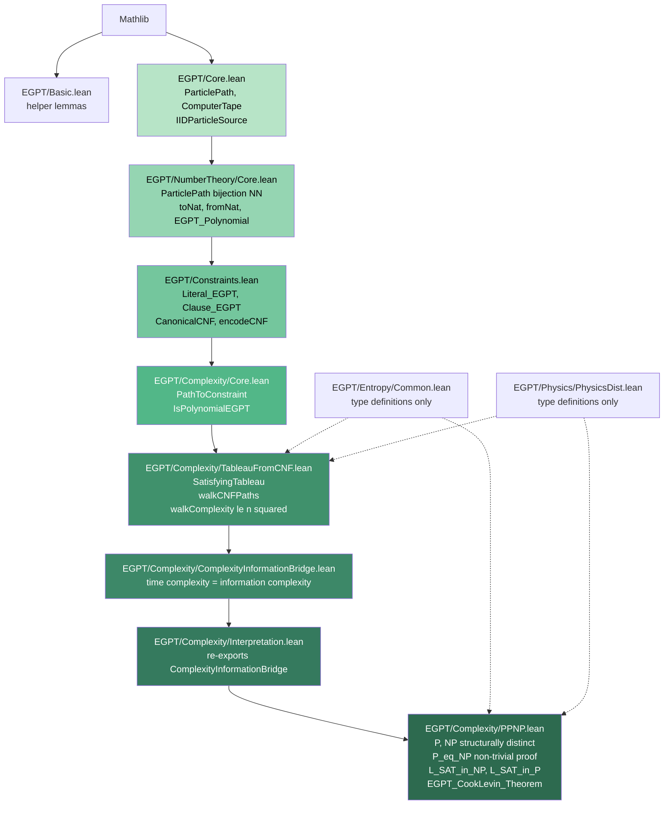
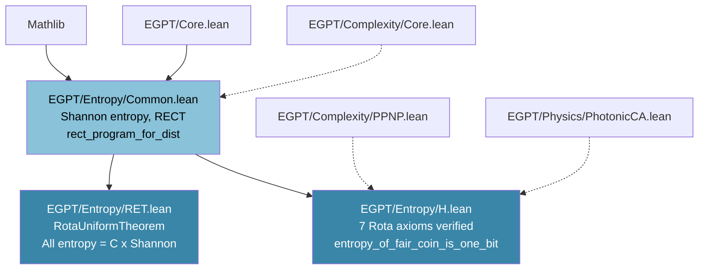
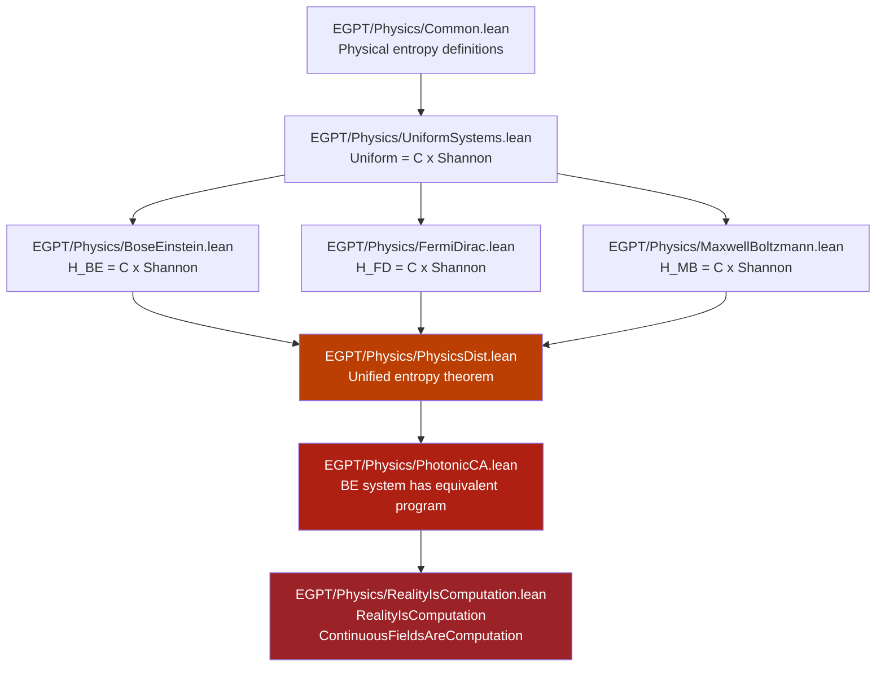
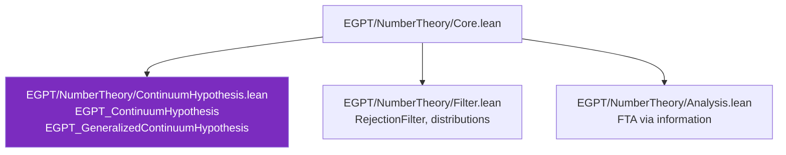

# EGPT Proof Dependency Graph

> 90 machine-verified theorems across 23 Lean 4 files.
> No `sorry`. No custom axioms. Only Lean's built-in `propext`, `Quot.sound`, `Classical.choice`.

This file provides the logical dependency structure of EGPT's formal proofs in a format optimized for both human reading and AI agent consumption. For the detailed file-by-file breakdown, see [`Lean/PROOF_DEPENDENCIES.md`](../Lean/PROOF_DEPENDENCIES.md).

## Core Identity

```
ParticlePath = ComputerTape = RandomWalkPath = List Bool
```

All three are `List Bool` with the `PathCompress_AllTrue` constraint. A natural number, a computation, and a random walk are the same object.

## P=NP Proof Chain (8 files, sorry-free, axiom-free)



Solid arrows = proof dependencies. Dashed arrows = type-only imports (no theorems used).

## Entropy Chain (Rota's Entropy Theorem)



## Physics Chain (motivation -- NOT imported by proof chain)



## Number Theory Extensions



## Full Logical Flow (Simplified)


## Isolation Guarantees

1. **Proof chain** (Core through PPNP) imports Entropy/Physics only for type definitions. No Entropy or Physics *theorem* is used in P=NP.
2. **Entropy chain** is independent -- RET stands alone as a proof about information measures.
3. **Physics chain** is downstream of everything. It is never imported by the proof chain.

## Machine-Readable Graph

See [`proof_graph.json`](proof_graph.json) for a JSON representation of the full dependency DAG, suitable for programmatic ingestion by AI agent frameworks.
