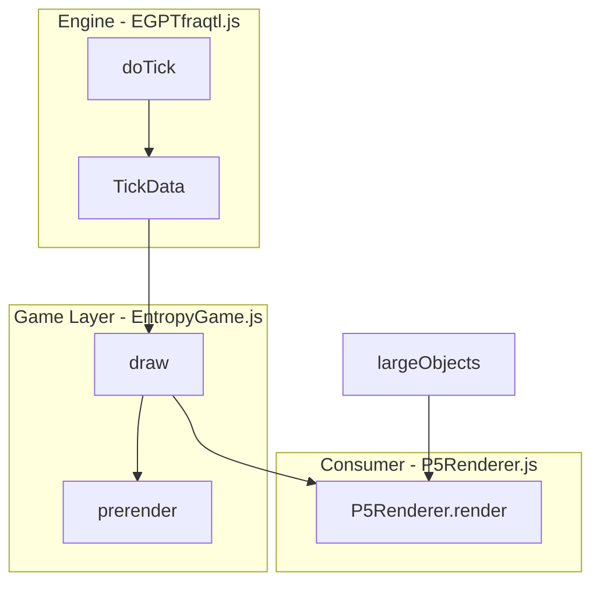

# egpt_devsdk Implementation Guide

This document describes the **as-built** EGPT FRACTAL engine in `egpt_devsdk`. It traces the actual code paths for frame generation, movement, and collision, using the BouncyBox (Blackbody) and BigBang simulations as worked examples.

For the theoretical/conceptual foundations, see the [EGPT FRACTAL Programming Guide](EGPT%20FRACTAL%20Programming%20Guide.md). Section 9 of this document notes where the as-built implementation diverges from the intended conceptual model.

---

## 1. Architecture: Engine / Game Layer / Consumer Separation

The engine is decoupled from rendering. The physics simulation produces data; consumers draw it.



```
Engine (EGPTfraqtl.js)              Game Layer (EntropyGame.js)         Consumer (P5Renderer.js)
  doTick() → TickData                 draw() calls doTick(), then         P5Renderer.render(tickData, largeObjects)
  Frame.fullness (0-1)                  P5Renderer.render()               fullness → chroma color → fill/ellipse
  Frame.toFrameData()                 prerender() for zoom/pan             LightColor color mapping
  No P5, no chroma                    Has P5 + chroma                     Requires P5.js + chroma
```

**Key data classes** (defined at bottom of `EGPTfraqtl.js`):

| Class | Purpose |
|-------|---------|
| `TickData` | Container for one tick's output: `universeData`, `dimensionData[]`, `frameData[]` |
| `FrameData` | Per-frame snapshot: id, layer, rect, fullness, mass, velocity, alive, childCount |
| `DimensionData` | Per-dimension summary: layer, frameCount, boundaryRect |
| `UniverseData` | Tick number, dimensionCount, boundaryRect |

`FrameData.fullness` = mass/capacity (0-1). Color is computed by the consumer using `LightColor.getRgbColorFromFullness(fullness)` + chroma, inside `P5Renderer.render()`.

**Node.js testability**: `engine.node.js` requires `quadtree.js` and `EGPTfraqtl.js`, exposes all engine classes via CommonJS. No browser dependencies needed. Use `createBlackbodySetup(context, options)` from `simulation/setupBlackbody.js` for identical config in Node tests. `P5Renderer` is optional (browser only).

---

## 2. Initialization: Constructor + init()

Initialization is a two-step process. The constructor sets engine-level defaults; `init()` configures the simulation parameters and creates the fundamental dimension.

### Constructor (10 arguments)

```javascript
new EGPTUniverse(fps, iframe_interval_seconds, withInterQuantumCollisions,
    withBonding, withFrames, emergentPhysics, minMBFillRate,
    universe_rect, wavelength_constant, lowest_dimension)
```

The constructor resets global state (`quantum_id`, `WAVELENGTH_CONSTANT`, `BROWNIAN_MOTION`) and stores the parameters. It does **not** create any dimensions.

### init() (8 arguments)

```javascript
universe.init(universe_rect, fundamental_dimension_number, planckConstant,
    isGreedy, noEscape, emergentDimensions, noObserverFrame, withWrapping)
```

Critical behavior:
- Sets `this.lowest_dimension = fundamental_dimension_number`
- Sets `this.smallestMBWidth = Math.pow(2, fundamental_dimension_number)`
- Calls `addDimension(fundamental_dimension_number)` to create the fundamental dimension
- If `noObserverFrame=true`, sets `brownianMotion = false`

After `init()`, game objects (OvenBox, BouncyBox, etc.) typically add higher dimensions and register tick functions.

### Worked Example: BouncyBox (Blackbody card)

Uses `createBlackbodySetup(context, { temperature: 300 })` from `simulation/setupBlackbody.js`:

```
1. context = { universe, canvas_rect }  (EntropyGame in browser, plain object in Node)

2. createBlackbodySetup(context, { temperature: 300 })
   → BouncyBox constructor receives context

3. BouncyBox: context.universe.init(canvas_rect, 0, 1, ...)
   → fundamental_dimension_number=0, addDimension(0) → dims=[0]
   → Leaf frames will be 1×1 (2^0)

4. BouncyBox sets universe.withInterQuantumCollisions = false

5. OvenBox calls universe.addDimension(4) → dims=[0, 4]
   → Parent frames will be 16×16 (2^4)

6. OvenBox sets universe.brownianMotion = true → BROWNIAN_MOTION=true

7. OvenBox registers tick function (temperature-controlled emitter)
   → Creates leaf frames at level 0 with vx/vy ∈ {±1, 0}
```

**Result at tick 1**: dims=[0, 4], emergentPhysics=0, BROWNIAN_MOTION=true, leaf frames are 1×1.

### Worked Example: BigBang

```
1. new EGPTUniverse(60, 1, false, false, true, 0, 0.1, canvas_rect, 1, 0)
   → emergentPhysics=0 (from constructor)

2. universe.emergentPhysics = true  (set before init)

3. universe.iframe_interval_seconds = 1/60  → iframe_interval_ticks = 1

4. universe.init(canvas_rect, 0, 1, false, false, true, false, false)
   → lowest_dimension=0, addDimension(0) → dims=[0]
   → emergentDimensions=true

5. PointSource registered as tick function
   → Creates leaf frames at level 0 with radial vx/vy
```

**Result at tick 1**: dims=[0], emergentPhysics=true, BROWNIAN_MOTION=false, iframe runs every tick. Higher dims spawned dynamically.

### Context and setup factories

Game objects (BouncyBox, OvenBox, SlitScreen, etc.) take a **context** object: `{ universe, canvas_rect }`. EntropyGame implements this shape, so in the browser pass `this.entropyGame` as context. In Node tests, use a plain object: `{ universe, canvas_rect: rect }`.

**createBlackbodySetup** (`simulation/setupBlackbody.js`) configures the Blackbody simulation identically for browser and Node:

```javascript
// Browser (Experiments.setupBlackBody)
const context = this.entropyGame;
const { bouncyBox } = createBlackbodySetup(context, { temperature: 300 });

// Node (test_blackbody.js)
const context = { universe, canvas_rect: rect };
const { bouncyBox } = createBlackbodySetup(context, { temperature: 300 });
```

Options: `fundamental_dim`, `quantum_dim`, `temperature`, `boxFraction`. Returns `{ universe, bouncyBox, temperatureDial }`.

---

## 3. The doTick Loop (4 Phases)

Each tick, `doTick()` executes four phases and returns a `TickData` object.

```
┌─────────────────────────────────────────────────────────────────┐
│ PHASE A: INJECTION                                              │
│   Run experiment tick functions → new leaf frames               │
│   addFundamentalFrames() → pushed to lowest dimension           │
├─────────────────────────────────────────────────────────────────┤
│ PHASE B: STRUCTURE BUILDING (every iframe_interval_ticks)       │
│   Build fundamentalDimQtree from lowest dim                     │
│   Each higher dim: addPointsFromQuadTree (absorb leaves)        │
│   [emergentPhysics only]: buildFramesFromSprites (spawn dims)   │
├─────────────────────────────────────────────────────────────────┤
│ PHASE C: PHYSICS UPDATE (every tick, per dimension)             │
│   For each dimension:                                           │
│     C.1: Optional inter-frame collisions (lowest dim only)      │
│     C.2: dim.update() → move, collide, merge, promote           │
│     C.3: Re-inject released frames                              │
├─────────────────────────────────────────────────────────────────┤
│ PHASE D: COLLECT TICK DATA                                      │
│   Gather FrameData from all dimensions → return TickData        │
└─────────────────────────────────────────────────────────────────┘
```

### Phase A: Injection

Experiment tick functions fire each tick. They return arrays of leaf frames which are pushed to `dimensions.get(lowest_dimension).frames`. For BouncyBox, this is temperature-controlled: `burst = (temp - activeQuanta) * ratio`.

### Phase B: Structure Building

Runs only when `tick % iframe_interval_ticks === 0` (every 60 ticks for BouncyBox, every tick for BigBang).

1. Build a QuadTree from the fundamental dimension's frames.
2. Iterate dimensions low-to-high. Each higher dim calls `addPointsFromQuadTree(qtree)`, which queries the tree for unparented frames that fit its frame size, creates frames from dense regions, and removes absorbed frames from the tree.
3. **emergentPhysics only**: `buildFramesFromSprites(unparented)` recursively creates a top-down hierarchy of new dimensions and frames from any remaining unparented leaves.

**BouncyBox**: Phase B feeds dim 4 from dim 0 leaves via `addPointsFromQuadTree`. No `buildFramesFromSprites`.
**BigBang**: Phase B runs every tick, feeding all existing dims plus `buildFramesFromSprites` spawning new ones (dim 1, 2, 3, ...).

### Phase C: Physics Update

Runs every tick for every dimension. The core step is `dim.update(tick, largeObjects)`:

1. **Reinit** dirty frames (recalculate mass/velocity from children)
2. **Move** each frame (unified integer probabilistic model, see Section 4)
3. **Compress** children toward parent center (if not highest dim)
4. **Collision detection**: `qtree.insertAll(frames)` returns frames that couldn't insert; `_setCollisionPair` sets `frame.other` on each collision pair
5. **For each collision pair**:
   - **Merge**: transfer children from smaller to larger in the overlap
   - **Promote**: `handleStructurePromotion` creates a parent in the next higher dimension (see Section 5)
6. **LargeObject collisions**: walls, detectors interact with frames
7. **Cleanup**: remove dead frames and empty non-leaf frames

### Phase D: Collect TickData

Iterates all dimensions, creates `DimensionData` and `FrameData` for each frame, packages into `TickData` and returns it. **Rendering is not done by the engine** — `EntropyGame.draw()` calls `doTick()` then `P5Renderer.render(tickData, this.universe.largeObjects)`.

---

## 4. Frame Movement Model

All frames use a unified integer probabilistic movement model. The max displacement per tick is 1 pixel per axis, always. Velocity (`vx`, `vy`) represents **accumulated momentum** that biases the *probability* of displacement direction. Momentum is **spent** by actual movement and **replenished** by external forces (parent cascade, attraction, collisions).

### Momentum spending model

Momentum inputs increase `|vx|`/`|vy|`: parent movement cascading via `move_children`, attractive force via `compress`, collision bounces. Momentum output decreases `|vx|`/`|vy|`: each 1px displacement consumes 1 unit of momentum from the velocity vector.

A particle with `vx=16, vy=0` moves +1 in X per tick, spending 1 momentum each time: `vx` decays as 16, 15, 14, ... until it reaches 0 and transitions to random walk. Without ongoing external forces, all momentum is eventually spent.

### Movement algorithm (inside `Frame.move`)

```
if frame is stationary: skip

if |vx| + |vy| == 0:
    dx, dy = random from {-1, 0, +1}  (pure random walk)
else:
    prob_x = |vx| / (|vx| + |vy|)

    // Momentum step: probabilistically pick one axis
    if random < prob_x:
        momentum_dx = sign(vx), momentum_dy = 0
    else:
        momentum_dx = 0, momentum_dy = sign(vy)

    if BROWNIAN_MOTION:
        noise_dx = random {-1, 0, +1}
        noise_dy = random {-1, 0, +1}
    else:
        // Perpendicular walk (wave-like oscillation)
        is_heads = random < p_up ? +1 : -1
        if momentum_dx != 0: noise_dy = is_heads
        else: noise_dx = is_heads

    dx = clamp(momentum_dx + noise_dx, -1, +1)
    dy = clamp(momentum_dy + noise_dy, -1, +1)

vx -= dx   // Momentum is SPENT by actual displacement
vy -= dy
```

### Integer position guarantee

`move_relative(dx, dy)` updates the rectangle atomically:
```javascript
this.rect._left = Math.round(this.rect.left + dx);
this.rect.right = newLeft + this.rect.w;
this.rect._x = newLeft + this.rect.w / 2;
// (same for top/bottom/y)
```

This bypasses the Rectangle setter chain which could introduce fractional values for odd-width rects. `boundary_check` also uses the same atomic update pattern.

### Parent effects on children (deferred momentum propagation)

- **move_children(dx, dy)**: When a parent moves, it cascades momentum to children via `child.vx += dx; child.vy += dy`. Children spend this momentum on their **next** `move()` tick. Since Phase C processes dimensions low-to-high (dim 0 children before dim 4 parents), children have already moved for the current tick when the parent's `move_children` runs — achieving deferred propagation per Law 2.
- **compress()**: Adds ±1 to each child's `vx`/`vy` toward the parent center. This is an indirect pull — it increases the probability of the child moving centerward on future ticks, not a direct displacement.

### Conceptual alignment

This model matches the Programming Guide's Law 7 (speed limit: max 1px/tick), Law 3 (Brownian motion), Law 6 (momentum as accumulated velocity biasing future probability), and Law 2 (deferred parent-to-child propagation via momentum cascade).

See [EGPT_DEVSDK_DIVERGENCE_AUDIT.md](EGPT_DEVSDK_DIVERGENCE_AUDIT.md) for the full vx/vy mutation catalog and detailed analysis of the momentum fixes.

---

## 5. Frame Promotion (Structure Creation)

Frame promotion creates parent frames in higher dimensions when lower-dimension frames collide. There are two independent paths.

### Path 1: Phase B — buildFramesFromSprites (top-down, emergentPhysics only)

Runs on iframe ticks. Takes unparented leaf frames, computes a bounding box, recursively subdivides into quadrants, and creates frames at each level. Spawns new dimensions as needed via `addDimension`.

This is the **BigBang's primary frame creation path**. It builds the entire hierarchy top-down every iframe tick.

**Not used when emergentPhysics=false** (BouncyBox relies entirely on Path 2).

### Path 2: Phase C — handleStructurePromotion (bottom-up, event-driven)

Runs every tick, triggered by collisions in `Dimension.update`.

**Preconditions** (all must pass):
1. `frameA !== frameB` (not self-paired)
2. Both alive
3. Both unparented
4. Frames actually overlap (`rect.overlaps`)

**Next-dimension lookup**:
```javascript
let nextLayer = this.universe.dimensions.getNextKey(this.layer);
```
Uses `SortableDictionary.getNextKey` which supports non-consecutive dimensions (e.g. layer 1 → layer 4).

**Branching on emergentPhysics**:
- `emergentPhysics=true`: If no next dim exists, spawn one at `layer + 1`
- `emergentPhysics=false`: If no next dim exists, stop (developer must pre-register it)

**createParentFrame(childA, childB)**:
1. Compute bounding box of both children
2. Check span fits within `mb_w × mb_h` of the parent dimension
3. Create a new Frame at the parent dimension's layer, positioned to contain both children
4. Call `addPoints([childA, childB])` to insert children
5. If successful, push to parent dimension's frames array

### Worked Example: BouncyBox promotion

Dims = [0, 4]. Two 1×1 leaf frames in dim 0 collide:
- `getNextKey(0)` returns `4`
- Parent dim 4 has `mb_w=16, mb_h=16`
- `createParentFrame` creates a 16×16 frame containing both 1×1 children
- The parent is added to dim 4

### Worked Example: BigBang promotion

Dims start as [0]. Two 1×1 leaf frames in dim 0 collide:
- `getNextKey(0)` returns `undefined` (no dim 1 yet)
- `emergentPhysics=true` → spawn dim 1 via `addDimension(1)`
- `createParentFrame` creates a 2×2 frame in dim 1
- Later, dim 1 frames collide → spawn dim 2, and so on

### Coexistence of both paths

When `emergentPhysics=true` (BigBang), **both paths run**. Phase B builds the hierarchy top-down from unparented leaves; Phase C adds parents bottom-up from collisions. This can create redundant structures. When `emergentPhysics=false`, only Phase C runs.

---

## 6. Collision System

### QuadTree collision detection

`Dimension.update` builds a quadtree and inserts all frames via `qtree.insertAll(frames)`. Frames that can't be inserted (cell at capacity and can't subdivide further) are returned in the collision list. The quadtree calls `_setCollisionPair(t, existing)` which sets `t.other = existing` and `existing.other = t`.

### Merge

`Frame.merge(other)`: identifies larger (by mass) as taker, smaller as giver. Computes the overlap rectangle. Transfers children from giver to taker if they're within the overlap. If `removal_list` is empty (no children transferred, e.g. leaf-to-leaf), `remove_children` is not called. Leaf frames are never killed by merge (guard: `if (this.children.length === 0 && !this.is_leaf)` in `remove_children`).

### Inter-frame collisions (optional)

When `withInterQuantumCollisions=true`, Phase C Step C.1 builds a separate quadtree for the lowest dimension and calls `checkCollision` on each frame with its neighbors. This uses distance-based detection (`Math.hypot`) and triggers merge + bounce + charge/bond.

### LargeObject collisions

Walls and detectors (`LargeObject`) collide with frames via `lo.collide(qtree, mb_w)`. Effects are determined by `CollisionTypes` (velocity changes: REFLECT, BOUNCE, MOMENTUM_BASED) and `CollisionActions` (outcomes: ABSORB, KILL, BLOCK, RECOLOR, COUNT).

See [COLLISION_SYSTEM_DESIGN.md](COLLISION_SYSTEM_DESIGN.md) for the full collision type/action reference tables.

---

## 7. Parameter Impact Reference

| Parameter | Set by | Impact |
|-----------|--------|--------|
| `emergentPhysics` | Constructor, or directly | Controls dim spawning in Phase B (`buildFramesFromSprites`) and Phase C (`handleStructurePromotion`). When true, new dims are created on demand. |
| `fundamental_dimension_number` | `init()` arg | Sets leaf frame size (`2^n × 2^n`) and `lowest_dimension`. All injected frames go here. |
| `BROWNIAN_MOTION` | `universe.brownianMotion = true/false` | When true: random ±1 noise on any axis. When false: perpendicular walk (wave-like). OvenBox sets true; BigBang leaves false. |
| `iframe_interval_ticks` | Derived from `fps × iframe_interval_seconds` | How often Phase B runs. BouncyBox: every 60 ticks. BigBang: every tick (`iframe_interval_seconds = 1/60`). |
| `withInterQuantumCollisions` | Set by experiment | Enables Phase C Step C.1 (inter-frame collisions in lowest dim). BouncyBox: false. |
| `minMBFillRate` | Constructor | Threshold for frame creation in `generateFrames`. A 16×16 dim with `minMBFillRate=0.1` requires 26 children to create a frame. |
| `noObserverFrame` | `init()` arg | When true, sets `brownianMotion=false`. Use for laser/beam experiments where particles should propagate freely. |
| Dimension registration | `addDimension(n)` | Pre-registers dimensions for non-emergent experiments. Determines which parent dimensions are available for promotion. Non-consecutive is supported (e.g. [1, 4]). |

**EGPT setup constraints**:
- Fundamental particle size must be `2^n × 2^n`, so `fundamental_dimension_number` must be an integer `n >= 0`.
- Fundamental wave period should be an integer divisible by `4` so quarter-wave phase transitions remain integral.
- In devsdk setup factories, developer-facing values such as `fundamentalWaveLength` may be translated into an integer `planckConstant`. If the requested wavelength is not exactly representable after rounding, the setup layer should warn or throw rather than silently drifting from the requested behavior.

---

## 8. BouncyBox vs BigBang: Side-by-Side Comparison

| Aspect | BouncyBox (Blackbody card) | BigBang |
|--------|---------------------------|---------|
| `emergentPhysics` | `0` (false) | `true` |
| `fundamental_dimension_number` | `0` (1×1 leaves) | `0` (1×1 leaves) |
| `BROWNIAN_MOTION` | `true` (set by OvenBox) | `false` |
| Dimensions at init | `[0, 4]` (pre-registered) | `[0]` (rest spawned) |
| `iframe_interval_ticks` | `60` (once per second) | `1` (every tick) |
| Phase B `buildFramesFromSprites` | Skipped | Runs every tick |
| Phase C promotion | Event-driven, requires pre-registered dim | Event-driven, spawns dims |
| Frame injection | OvenBox emitters (temp-controlled) | PointSource (radial burst) |
| LargeObjects | 4 walls (BOUNCE) | None |
| Leaf velocities | Axis-aligned ±1,0 | Radial from center |

---

## 9. Divergences from the Conceptual Guide

The [EGPT FRACTAL Programming Guide](EGPT%20FRACTAL%20Programming%20Guide.md) describes the theoretical model. The as-built implementation is a work-in-progress toward that model. Key divergences:

### 9.1 Attractive force: compress() vs attract()

**Guide (Law 5)**: `Frame.attract(child)` computes direction toward center and applies a 1px nudge probabilistically along the axis that is "more off-center."

**As-built**: `compress()` adds ±1 to the child's `vx`/`vy` toward the parent center. This is an indirect pull — it increases the *probability* of future movement toward center via momentum bias, rather than directly displacing the child. The effect converges over time but is delayed by one tick compared to the Guide's description.

### 9.2 Parent movement propagation ~~(RESOLVED)~~

**Guide (Law 2)**: `Frame.updateChildren` tells children how much the parent moved. Children apply this parent movement *on their next tick* (deferred propagation to respect relativity).

**As-built**: `move_children(dx, dy)` cascades parent displacement as momentum to children via `child.vx += dx; child.vy += dy`. Since Phase C processes dimensions low-to-high (children before parents), children have already moved for the current tick when the parent's `move_children` runs. Children apply the parent momentum on their **next** tick — achieving deferred propagation as the Guide describes.

*Note: This was fixed as part of the momentum model audit. Previously, `move_children` used `child.move_relative(dx, dy)` which applied the parent's displacement immediately. See [Divergence Audit](EGPT_DEVSDK_DIVERGENCE_AUDIT.md) for details.*

### 9.3 Spatial index: QuadTree vs FrameTree

**Guide**: References `FrameTree` as the spatial index.

**As-built (egpt_devsdk)**: Uses `QuadTree` (defined in `quadtree.js`). The `FrameTree` exists in `FRAQTLServer/FrameTree.js` but is not used in egpt_devsdk.

### 9.4 Constructor signature

**Guide**: Shows `new EGPTUniverse(canvasRect)` (1-arg, matching egpt_core's 3-arg constructor).

**As-built (egpt_devsdk)**: 10-arg constructor. `canvas_rect` goes in position 8. Passing it as the first arg breaks `iframe_interval_ticks`.

### 9.5 emergentDimensions vs emergentPhysics ~~(RESOLVED)~~

**Guide**: Describes `emergentDimensions` as the parameter controlling dynamic hierarchy.

**As-built**: `init()` accepts `emergentDimensions` as a parameter name (for backward compatibility) but immediately maps it to `this.emergentPhysics`, which is the canonical property used for all branching logic in `doTick`, `handleStructurePromotion`, and `buildFramesFromSprites`. The constructor also sets `emergentPhysics` directly. The two names now refer to the same property.

### 9.6 Frame hierarchy building: top-down vs bottom-up

**Guide**: Implies a recursive top-down hierarchy where the engine builds frames from the largest scale down to the fundamental quanta.

**As-built**: Uses both approaches simultaneously when `emergentPhysics=true`:
- Phase B (`buildFramesFromSprites`): top-down recursive subdivision
- Phase C (`handleStructurePromotion`): bottom-up event-driven from collisions

When `emergentPhysics=false`, only the bottom-up path (Phase C) creates parent frames. The periodic Phase B `addPointsFromQuadTree` absorbs existing leaves into pre-registered dimensions but does not create new frames via subdivision.

### 9.7 doTick return value

**Guide**: Shows `universe.doTick()` as a void call followed by manual rendering.

**As-built**: `doTick()` returns a `TickData` object. Rendering is handled by `P5Renderer.render(tickData, largeObjects)` in `EntropyGame.draw()`. This separation enables Node.js testing without P5.js.
